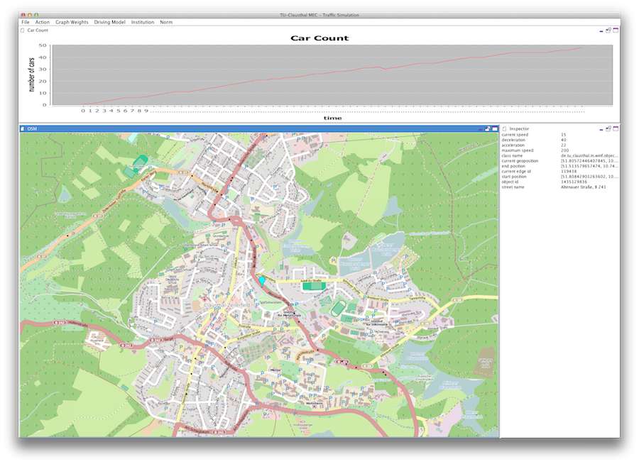

# MecSim - Traffic Simulation



## Requirements

* [Java 1.8](http://www.java.com)
* [Maven](http://maven.apache.org/)
* [Doxygen](http://www.doxygen.org/)

### tested IDEs

* [IntelliJ Community Edition](http://www.jetbrains.com/idea/)
* [Eclipse](http://www.eclipse.org/)


## Installation / Configuration

Hourly a [current developer build](https://mecdev.rz-housing.tu-clausthal.de/jenkins/job/MecSim/) can be downloaded.

The Maven package build creates a Jar file in the path ```target/MecSim-<Version>-jar-with-dependencies.jar```. You can
get a help information of all command-line parameter with the ```--help``` suffix. The program must use more memory of
the Java VM on graph downloading and converting, so the Jar must be started with the suffix ```-Xmx<Memory Size>``` (a
good value can be ```2g```)

The program can be used in two structures:

 * GUI based - you need run the Jar file directly
 * non-ui based - you need run the Jar file with the parameter ```--nogui <mecsim data file, that should load> --step <number of iterations>```

### Configuration

The default path of the configuration is ```~/.mecsim``` (hidden directory ```.mecsim``` in the user home directory).
The [JSON](http://en.wikipedia.org/wiki/JSON) file stores the simulation configuration values,
the [XML](http://en.wikipedia.org/wiki/XML) file the layout of the UI widgets, the ```graphs``` subdirectory the
imported graphs and the ```tile.openstreetmap.org``` subdirectory the world tiles for viszualisation. The UI and main
configuration file is read on startup and is write down on program exit.

The [JSON](http://en.wikipedia.org/wiki/JSON) file has got the following structure:


    {
        "CellSampling": 2,
        "RoutingAlgorithm": "astarbi",
        "RoutingMap": {
            "name": "europe/germany/lowersaxony",
            "url": "http://download.geofabrik.de/europe/germany/niedersachsen-latest.osm.pbf"
        },
        "ThreadSleepTime": 25,
        "ViewPoint": {
            "latitude": 51.80890000000001,
            "longitude": 10.3412
        },
        "WindowHeight": 1024,
        "WindowWidth": 1684,
        "Zoom": 4
    }

* _CellSampling_ defines the cell sampling size (in metre) of any lane / road
* _RoutingAlgorithm_ defines the routing algorithm on the graph (values are: _astar_ & _astarbi_ (A* algorithm),
_dijkstra_, _dijkstrabi_, _dijkstraOneToMany_ (Dijkstra algorithm))
* _RountingMap_ defines the imported OpenStreetMap dataset (see data import), the value _name_ defines the name of
card (all ```/``` will be replaces with ```_```) and _url_ defines the download URL of the
[PBF](http://wiki.openstreetmap.org/wiki/PBF_Format) file
* _ThreadSleepTime_ defines the time (in milliseconds) of the thread sleep (the value represent the simulation speed)
* _ViewPoint_ defines the _latitude_ and _longitude_ geo coordinates of the current position, which is shown on startup
* _WindowWidth_ and _WindowHeight_ define the main window size

### Data Import

The simulation obtains the data of the traffic graph from the service [Geofabrik](http://download.geofabrik.de/), which
provides [OpenStreetMap](http://www.openstreetmap.de/) data of different countries and regions. On startup the
simulation downloads the OSM files, which can take some time and converts the OSM data into the traffic graph (these
steps needs more memmory (see installation). On startup the simulation tries to load a graph from the directory,
which is defined by the _name_ value, if the graph cannot be loaded the simulation downloads the data from the given
URL, converts the data into the graph structure and stores the graph in the graph subdirectory with given _name_

The default import is _Lower Saxony (Europe Germany)_.

For map replacing the value _RoutingMap_ must be changed:

* get the new URL of your favorite map (it must be an URL to a [PBF](http://wiki.openstreetmap.org/wiki/PBF_Format) file)
* replace the _url_ value on the _RoutingMap_ and set an unique name in the _name_ value


## Using

After the startup the GUI of the simulation is shown. The main windows defines different widgets. Each widget defines a
working area:

* on the map view you can add with the double click new sources
* with the context menu you can change the type of the sources
* the map can be moved / zoomed with mouse moving / scrolling
* on the _simulation_ menu the simulation can be stopped, started and resettet, a reset remove all cars
* the _graph weights_ menu defines different weight, which are used by calculating the route
* the _driving model_ menu shows all selectable traffic driving models
* the _layer_ menu shows all layer of the world, each layer can be enabled / disabled for calculation and/or viewing
* the _file_ menu allows you to store / load the simulation data and take a screenshot of the map
* some objects of the simulation are clickable, the data of these objects are shown in the _inspector_

### Startup Parameter

The simulation Jar file supports different startup parameters:

* ```--help``` shows all definied parameters
* ```--configuration``` defines the configuration path (default: ```~/.mecsim```)
* ```--loglevel``` defines the logging level (allowed values are: _off_, _debug_, _error_, _info_, _trace_, _warning_)
* ```--logfile``` defines the logfile (defaul value: ```<current directory>/mecsim-<timestamp>.txt```)
