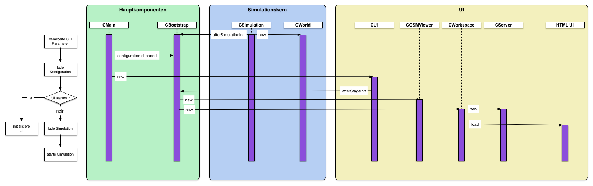
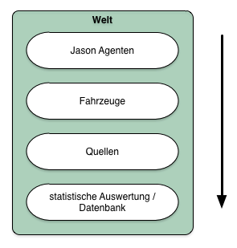

# Funktionsweise

## System-Start

Der Start des Programms verläuft in verschiedenen _Stages_, die die verschiedenen Ebenen des Systems mit den notwendigen Komponenten starten. Jede Ebene des
Systems ist für sich gesehen eine abschlossene Struktur. Für den Startvorgang ist maßgeblich die Klasse _CBootstrap_ verantwortlich, in der zentral alle
Events verarbeitet werden. Eine Besonderheit ist das Präprozessing beim Start durch die Java Runtime. Der Initialstart erfolgt in der Klasse _CBoot_ über
die die aktuelle Version und der Hersteller der Java Runtime geprüft wird, diese leitet dann den weiteren Startup-Prozess an die Klasse _CMain_ weiter, in
der der eigentliche Start durchgeführt wird. Die nachfolgenden Diagramme visualisiert den groben Startprozess.




### Start der Simulationsumgebung

Die Simulationsumgebung ( _CSimulation_ mit _CWorld_) wird immer gestartet. Die Simulation repräsentiert den Kern, d.h. die Berechnungsstruktur für alle
Simualtionsobjekte. Die Welt beinhaltet alle Objekte, die simuliert werden sollen mit ihren dazugehörigen Strukturen. Dieser Simulationskern hat keine
direkte visuelle Repräsentation, so dass die Simulation auch ohne UI gestartet werden kann. 


### Start der UI

Die UI ist optional und wir somit in Abhängigkeit der Programmübergabe-Parameter geladen. Die UI besteht einmal aus den Tabs innerhalb der Java Anwendung und
der HTMl darstellung. Die Tabs ( _Main_ und _OSM_ ) sind die internen Java-Komponenten die direkt durch den Simulationskern angesprochen werden können. Die
Darstellung innerhalb des Tabs _Main_ stellt für den Benutzer die Eingabemasken mittels HTML dar. Die Default-Einstellungen für das Binden des Webservers
ist die URL ```http://localhost:9876``` vorgesehen. Über die Programmparameter kann diese Adresse beim Start überschrieben werden.


## Konfiguration / Speicherort

### Programmparameter

Dem Programm können initiale Parameter mit gegeben werden, um den Startprozess zu beeinflussen.

### Speicherort


## Weltaufbau

Die Welt ist als _Schichtstruktur_ ([[Mannigfaltigkeit]]) aufgebaut, so dass jede Schicht als _eigenständige Struktur_ ([[Topologischer Raum]]) aufgefasst werden
kann. Jede Schicht der Welt kann Simulationsobjekte enthalten, die bei Ausführung durch den Simulationskern ausgeführt werden. Es werden alle Objekte pro Schicht
verarbeitet, bevor die nächste Schicht bearbeitet wird. Die Schichten besitzen eine festgelegte Ordnung, in welcher Reihenfolge sie abgearbeitet werden. Das nachfolgende
Diagramm zeigt die den grundlegenden Aufbau.



Die Welt wird bildlich von _oben nach unten_ berechnet, d.h. von der Schicht mit dem kleinsten Index zu der Schicht mit dem größten. Als Standart-Verhalten werden
zuerst die _Jason Agenten, Fahrzeuge, Quellen_ und abschließend _statische Auswertung mit Transfer in eine Datenbank_ ausgeführt. 


