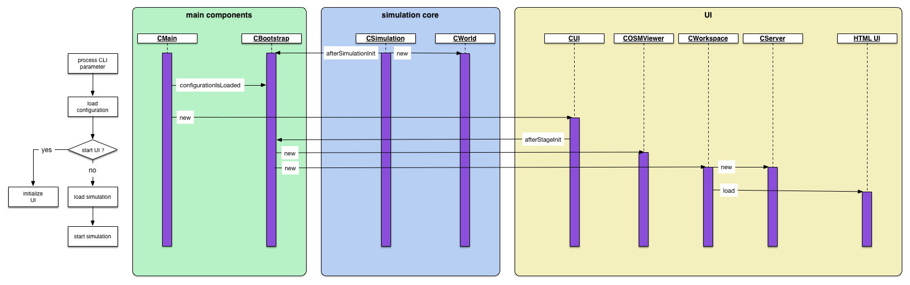

# Programfunctionality

## System-Start

The start if the program proceeds with different _stages_, which startup the different layers with its components. Each layer is a closed structure. The main
startup part is proceed by the class _CBootstrap_, which is the centralized structure of the main events. A special feature is the preprocessing on the Java
Runtime startup. The initial start of the program is definied by the class _CBoot_, which determinates the current Java version and vendor of the runtime.
The startup is continued by the class _CMain_, which creates the whole program startup. The diagram shows the structure:




### Start of the simulation environment

The simulation environment ( _CSimulation_ with _CWorld_) is start every time. The simulation represent the core, which represents the main evaluation of
all simulation objects. The world contains all objects, which are simulated with dependend data structures. The simulation core does not have a visual
representation, because the simulation can be start without UI.

### UI Start

The UI usage is optional and will be loaded in dependency of the program commandline arguments. The UI consists of tabs within the Java application and the
HTML representation. The tabs ( _Main_ and _OSM_ ) are internal Java components, which are processed directly by the simulation core. The view within the tab
_Main_ shows the UI components in HTML of the user access. The default properties of the web server binding is set to the URL ```http://localhost:9876```. The
URL can be changed by the commandline arguments, so the startup overwrite the default properties.


## Configuration / Storing

### Programparameter

The program can use initial parameter, which affects the startup process. All parameters with a short description can be shown with the parameter ```--help```.


### Storing

The default location of the data is the home directory of the user with the subdirectory ```.mecsim```. Within this directory exists the structure:

* the file```config.json``` contains all settings of the program
* the directory ```graphs``` contains the graph data of the simulation ([GraphHopper](https://graphhopper.com/))
* the directory ```jar``` can be used to store arbitrary [[JAR (file format)|JAR]], which are loaded automatically at startup e.g. database driver
* the subdirectory ```mas``` contains all script file of agents
* a [[Cache (computing)|cache]] of the map visualization is stored within the directory ```tile.openstreetmap.org```
* own HTML documents can be stored within the directory ```www``` and the document-root file must be named ```index.htm```
