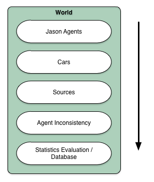

# World

## Layout

The world is based on a _layer structure_ ([[manifold]]), so much that each layer is defined like an _autonomously structure_ ([[topological space]]).
Each layer can contains simulation objects, which are run by the simulation core. All objects of a layer will be processed before the next layer is taken.
The layer structure is ordered, which defines a deterministic ordering of evaluation. The diagram shows the structure:

The world will be processed from top to bottom (lower index to higher index). The default behaviour of the evaluation process is first the _Jason Agents, cars,
waypoints / sources, inconsistency_ and at the end _statistics evaluation with transfer to database_.

## Traffic Model

The simulation supports the [[Nagel–Schreckenberg model]] to simulation the traffic in two different characteristics:

* an additional model, which defines individually acceleration- and decceleration at each car
* an modified additional model, which processes cars, that are handle by agents, in this case, that the agent has got the full surveillance about the car
(this model is set by default

### Traffic Network Sampling

### Time Sampling

 
 
 
 
## Perception of [Jason Agenten](jason.md)
 